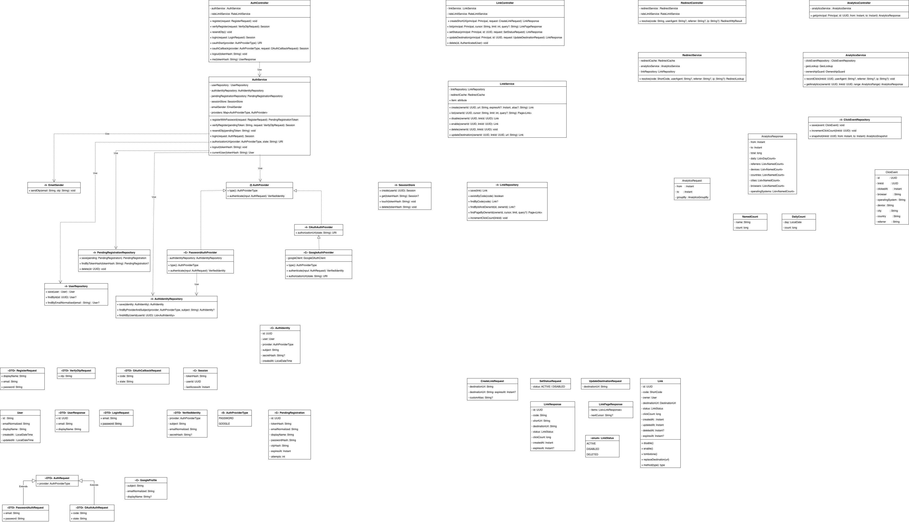

# TinyRoute architecture

Portfolio URL shortener for one developer. Anyone can follow a short URL; creating and managing links requires a signed-in account. This note traces the high-level and low-level design back to [Functional.md](../requirements/Functional.md) and [Non-Functional.md](../requirements/Non-Functional.md). Diagrams: [HLD.excalidraw](HLD.excalidraw), [LLD.drawio](LLD.drawio).

## Stack (locked)

| Piece       | Role                                                                                   |
| ----------- | -------------------------------------------------------------------------------------- |
| Next.js     | Browser UI. HTTP client only. It does not enforce ownership or redirect policy.        |
| Spring Boot | Source of application policy: validation, JWT access, refresh sessions, ownership, redirects, rate limits. |
| PostgreSQL  | System of record for users and links (including tombstones).                           |
| Redis       | Disposable: refresh sessions, JWT revocation, redirect cache (TTL ≤ 5 s), rate-limit counters. |

Single-region, modest hardware. HTTPS at the edge (NFR-SEC-01). Health check reports process + datastore (NFR-AVL-02).

## High-level design

Signed-in users hit Next.js, which calls the Spring Boot JSON API with HttpOnly cookies: a short-lived JWT access token and a Redis-backed refresh session (NFR-SEC-06). Visitors hit `GET /{code}` with no account. Ingress terminates TLS and routes both. Cookie-based JWTs still require CSRF on mutations.

Inside the monolith: Auth, URL (create/manage), Redirect, and a click-count path that is **not** on the redirect critical path. Redis is consulted first for redirects; a miss or Redis failure falls through to PostgreSQL. If PostgreSQL cannot determine link state, the service returns an error and **never** guesses a `Location` (NFR-REL-02).

Daily click trends, API keys, blocklists, and a separate analytics worker are growth/V1, not MVP Must.

## Layers (LLD)

Controllers translate HTTP only. Services own policy and transactions. Repositories own persistence. Redis access goes through adapters.

```
web          RedirectController, AuthController, LinkController, HealthController
security     JwtAuthenticationFilter, CsrfProtection, OwnershipGuard
application  AuthService, LinkService, RedirectService, RateLimitService,
             ClickCountService (async)
auth         AuthProvider map (PasswordAuthProvider, GoogleAuthProvider),
             OtpSender map (EmailOtpSender), GoogleOAuthClient, PasswordHasher,
             JwtTokenService
domain       User, AuthIdentity, PendingRegistration, Link, LinkStatus, ShortCode,
             DestinationUrl, RefreshSession, AccessToken, RedirectLookup, GoogleProfile
persistence  UserRepository, AuthIdentityRepository, PendingRegistrationRepository,
             LinkRepository  (interfaces)
             Jpa* adapters (parameterized JPA)
cache        RedirectCache, RefreshSessionStore, JwtRevocationStore, RateLimitStore  (interfaces)
             RedisRedirectCache, RedisRefreshSessionStore, RedisJwtRevocationStore,
             RedisRateLimitStore  (implementations)
```

Services depend on interfaces, not on Redis or JPA types. That is the same pattern as a typical LLD class diagram: `uses` from controller to service, `depends on` from service to repository/store interface, `implements` from `Jpa*` / `Redis*` to that interface.

Page 1 of [LLD.drawio](LLD.drawio) is an IntelliJ-style UML class diagram. The HTTP entry points are `AuthController`, `LinkController`, `RedirectController`, and `HealthController`; there is no duplicate facade. Controllers **use** application services, services **depend on** repository/store interfaces, and `Jpa*` / `Redis*` adapters **implement** those interfaces. `JwtAuthenticationFilter` and `CsrfProtection` intercept only the applicable protected requests.



## Component interactions

Who calls whom. Solid = on the request path. Dashed = async and must not block.

### Public redirect (`GET /{code}`)

Visitor → HTTPS ingress → **RedirectController** (no session, no CSRF, no ownership).

1. RedirectController → **RateLimitService**.allowRedirect → **RateLimitStore** → Redis `rl:redirect:{clientHash}`
2. RedirectController → **RedirectService**.resolve
3. RedirectService → **RedirectCache**.get (and put on DB success) → Redis `redirect:{code}`
4. On miss / Redis down / malformed cache: RedirectService → **LinkRepository**.findByCode → PostgreSQL
5. After a 3xx only: RedirectService ⋯ **ClickCountService**.recordSuccessfulRedirect ⋯ LinkRepository (increment `click_count`)

Redirect path does **not** call AuthService, LinkService, RefreshSessionStore, JwtRevocationStore, OwnershipGuard, UserRepository, or Next.js. ClickCountService does **not** call RedirectCache.

### Register / sign-in / refresh / sign-out

Next.js → HTTPS ingress → **CsrfProtection** (mutations) → **AuthController**.

1. AuthController → **RateLimitService**.allowAuth → RateLimitStore → Redis `rl:auth:{clientHash}` (register/login/verify/oauth/refresh/password-reset)
2. AuthController → **AuthService**. `login` uses `providers.get(type)`; OTP uses `otpSenders.get(EMAIL)`.
3. Password register: **PendingRegistrationRepository** + `OtpSender.send`; set `pending_registration` cookie (no access or refresh tokens yet). Verify body is OTP only.
4. Verify / password login / Google callback: **UserRepository** + **AuthIdentityRepository** → PostgreSQL `users` / `auth_identities`
5. AuthService → **JwtTokenService**.createAccessToken (15 min JWT) and **RefreshSessionStore**.create → Redis `refresh:{tokenHash}` (sliding 30-day TTL). Controller sets `access_token` and `refresh_token` cookies; tokens are never returned in JSON (NFR-SEC-06).
6. **JwtAuthenticationFilter** (logout / me / owner APIs) verifies the access JWT, then **JwtRevocationStore**.isRevoked(`jti`). Refresh is not consulted on every request.
7. `POST /api/auth/refresh` uses the refresh cookie only: RefreshSessionStore.get/touch, then a new access JWT. Rate-limited with other auth calls.
8. Logout: RefreshSessionStore.delete current refresh session; JwtRevocationStore.revoke current `jti` until access-token expiry (NFR-SEC-09).
9. Google: `GoogleAuthProvider` → **GoogleOAuthClient**.exchangeCode (in-memory; do not persist Google tokens)

Register has no prior tokens. Google skips OTP. Auth path does **not** call RedirectService, LinkRepository, RedirectCache, or OwnershipGuard. Account deletion (Could) is the exception that may call LinkService to tombstone owned links.

### Owner create / list / manage

Next.js → HTTPS ingress → **JwtAuthenticationFilter** (required) → **CsrfProtection** (POST/PATCH/DELETE) → **LinkController**.

1. LinkController → RateLimitService.allowCreate → RateLimitStore → Redis `rl:create:{userId}` (**create only**)
2. LinkController → **LinkService** (all link operations)
3. LinkService → **OwnershipGuard**.requireOwned on status / destination / delete
4. OwnershipGuard → LinkRepository.findByIdAndOwnerId (missing and non-owned both 404)
5. LinkService → LinkRepository.save / findPageByOwnerId → PostgreSQL `links`
6. After successful commit: LinkService → RedirectCache.evict → Redis `DEL redirect:{code}`

Next.js never checks `owner_id`. Link path does **not** call AuthService, RedirectService, ClickCountService, or UserRepository (user id comes from the verified JWT `sub`).

### Health

Monitor → HTTPS ingress → **HealthController** → UserRepository/DataSource ping → PostgreSQL (required for UP). Redis PING is optional; Redis loss must not mark the app down (NFR-AVL-02).

Health does **not** call Auth/Link/Redirect services, rate limits, CSRF, JWTs, or refresh sessions.

### Cross-flow coupling (same beans)

| Writer                          | Shared component             | Reader                                        |
| ------------------------------- | ---------------------------- | --------------------------------------------- |
| LinkService (after commit)      | RedirectCache                | RedirectService (cache-aside)                 |
| AuthService                     | RefreshSessionStore          | AuthService.refresh; delete on logout         |
| AuthService / JwtAuthenticationFilter | JwtRevocationStore     | JwtAuthenticationFilter on later requests     |
| RateLimitService                | RateLimitStore               | the same RateLimitService on the next request |
| ClickCountService (async)       | LinkRepository `click_count` | LinkService.list (informational; may lag)     |

Next.js never talks to PostgreSQL, Redis, repositories, OwnershipGuard, or RedirectService.

## Domain model (MVP Must)

**User** — `id`, `emailNormalized`, `displayName`, `tokenVersion`. No `passwordHash` on User. Password hashes live on `AuthIdentity` (`PASSWORD` only). Argon2id/bcrypt with per-user salt (NFR-SEC-02). Increment `tokenVersion` on password reset and account deletion so previously issued JWTs fail verification (NFR-SEC-09).

**AuthIdentity** — `provider` (`PASSWORD` | `GOOGLE`), `subject` (normalized email or Google `sub`), optional `secretHash`. Unique `(provider, subject)`. No OTP or display name here.

**PendingRegistration** — password signup before OTP succeeds: hashed password, hashed OTP, display name, email. Found via `pending_registration` cookie token, not via email on `VerifyOtpRequest`.

**Link** — `id`, `code` (ShortCode), `owner`, `destinationUrl`, `status`, timestamps, optional `deletedAt`, informational `clickCount` (may lag ≤ 1 min). Destination is **https-only and owner-editable** (FR-CRE-03, FR-MGT-07). Codes are case-sensitive, unique, and never reused (FR-CRE-04, FR-RED-06, FR-MGT-05).

**LinkStatus** — `ACTIVE` | `DISABLED` | `DELETED`. Delete writes a tombstone; the row stays so the code cannot be issued again.

**ShortCode** — generate or parse; uniqueness is the database unique constraint plus bounded retry on conflict. Never overwrite an existing code.

**DestinationUrl** — well-formed `https`; reject destinations that point at TinyRoute’s own host (FR-CRE-06 Should).

**RefreshSession** — opaque random refresh token in an HttpOnly / Secure / SameSite cookie; only the token hash lives in Redis as `refresh:{tokenHash}` → `{userId, lastAccessAt}`, with a sliding 30-day idle TTL (NFR-SEC-06, FR-ACC-03). Used only to mint a replacement access JWT. Raw refresh tokens are never stored.

**AccessToken** — signed JWT, 15-minute expiry, HttpOnly / Secure / SameSite cookie. Claims: `sub` (user UUID), `jti`, `iat`, `exp`, `typ=ACCESS`, `tokenVersion`. No email, password data, or OAuth tokens (NFR-PRV-01). Signing keys come from the environment and include a `kid` for rotation (NFR-SEC-10). On logout, `jti` is written to `revoked-access:{jti}` until `exp`.

**RedirectLookup** — `{status, destination?}`. A malformed or incomplete cache entry is a miss, never a redirect.

**User 1 — owns — 0..\* Link.** **User 1 — owns — 1..\* AuthIdentity.**

Should / V1-adjacent types (dashed package on the class diagram, not mixed into core): `expiresAt` on Link (FR-CRE-08), `CustomAlias` (FR-CRE-07), `PasswordResetToken` (FR-ACC-04), `DailyClickAggregate` (FR-ANA-03). If `expiresAt` is present, past expiry must stop redirecting without owner action (FR-RED-07) and the code is still never reused.

Out of the class model: destination blocklist, public API keys, admin console, safe-browsing. Do not add OTP/display name on `AuthIdentity`, per-provider fields on `AuthService`, Google tokens in PostgreSQL, email on `VerifyOtpRequest`, or an `smsSender` field on `AuthService`.

## Data

**PostgreSQL**

- `users(id, email_normalized UNIQUE, display_name, token_version, created_at, updated_at)`
- `auth_identities(id, user_id FK, provider, subject, secret_hash NULL, created_at)` UNIQUE `(provider, subject)`
- `pending_registrations(id, token_hash UNIQUE, email_normalized, display_name, password_hash, otp_hash, expires_at, attempts)`
- `links(id, code UNIQUE case-sensitive, owner_id FK, destination_url, status, click_count, created_at, updated_at, deleted_at, expires_at?)`
- Index `(owner_id, created_at DESC, id DESC)` for cursor pagination.
- FK `owner_id` RESTRICT: account deletion is Could, not MVP Must.

**Redis**

| Key                          | Value                    | TTL / notes                                                   |
| ---------------------------- | ------------------------ | ------------------------------------------------------------- |
| `redirect:{code}`            | RedirectLookup           | ≤ 5 s; evict after commit of create/status/destination/delete |
| `refresh:{tokenHash}`        | `{userId, lastAccessAt}` | sliding 30 days; delete on logout; delete-all on reset/delete |
| `revoked-access:{jti}`       | marker                   | remaining access-token lifetime; checked by JwtAuthenticationFilter |
| `rl:auth:{clientHash}`       | counter                  | auth cap (FR-ABS-02)                                          |
| `rl:create:{userId}`         | counter                  | create cap (FR-ABS-01)                                        |
| `rl:redirect:{clientHash}`   | counter                  | redirect throttle (FR-ABS-03 Should)                          |

Client IP is hashed for rate-limit keys and not retained beyond 24 hours (NFR-PRV-02). Click analytics store no visitor IP or identifier (FR-ANA-01/02, NFR-PRV-03).

**Consistency:** commit to PostgreSQL, then evict the redirect cache. Stale cache cannot outlive the ≤ 5 s TTL (NFR-CON-01/02). Redis loss blocks new login and refresh and fail-closes revocation checks; it does not change the database truth. Unexpired access JWTs whose `jti` cannot be checked are rejected.

## Flows

**Register / sign-in / create** — Rate-limit auth. Password register stores a pending row, emails an OTP, and sets a pending cookie. Verify OTP (cookie + `{otp}` only) creates `User` + `AuthIdentity(PASSWORD)`, an access JWT, and a refresh session. Login uses the provider map and issues the same two cookies. Google uses `GoogleOAuthClient.exchangeCode` then the same cookies (no OTP, no stored Google tokens). Create requires a valid access JWT + CSRF, `rl:create:{userId}`, https + self-host checks, insert a new code (retry only on unique conflict), then evict `redirect:{code}`.

**Public redirect** — Validate code + optional redirect throttle → cache-aside → on miss, case-sensitive DB lookup. Redirect only when state is **known ACTIVE with a destination**. DISABLED → unavailable (no owner details). UNKNOWN/DELETED → not-found. Uncertain datastore → safe 5xx, no `Location`. After a successful 3xx, `ClickCountService` runs asynchronously.

**Owner manage** — Valid access JWT + CSRF. List is always `WHERE owner_id = :userId`. Disable, re-enable, delete, and edit destination load `id AND owner_id` in one query (missing and non-owned both 404; NFR-SEC-04). Disable/enable are idempotent. Delete tombstones the row. Destination edit re-validates https. After commit, evict the cache.

**Refresh / logout / reset** — Refresh uses the refresh cookie to mint a new access JWT and slide the Redis TTL. Logout deletes the current refresh session and revokes the current access `jti`. Password reset and account deletion increment `tokenVersion`, delete all refresh sessions for the user, and reject JWTs whose `tokenVersion` no longer matches.

## HTTP boundary (MVP)

Public: `GET /{code}`, `GET /actuator/health`.

Auth: `POST /api/auth/register`, `POST /api/auth/register/verify`, `POST /api/auth/register/resend-otp`, `POST /api/auth/login`, `POST /api/auth/refresh`, `GET /api/auth/{provider}/start`, `GET /api/auth/{provider}/callback`, `POST /api/auth/logout`, `GET /api/auth/me`.

Owner: `POST /api/links`, `GET /api/links`, `PATCH /api/links/{id}/status`, `PATCH /api/links/{id}/destination`, `DELETE /api/links/{id}`.

Errors stay generic (NFR-SEC-08): 401, 403 CSRF, 400 validation, 404 missing/not owned, 409 after bounded code retries, 429 with retry guidance, safe 5xx.

## Quality targets that shape the design

Redirect p95 &lt; 150 ms / p99 &lt; 300 ms at ~100 rps (NFR-PER-01/03). Create/list/manage p95 &lt; 500 ms (NFR-PER-02). State changes visible within 5 s including cache (NFR-CON-02). Daily backups, 24 h RPO, 4 h RTO (NFR-BAK-01..03). Structured logs without secrets (NFR-OBS-01). CI, versioned migrations, repeatable deploy (NFR-MNT-01, NFR-DEP-01/02).

## Growth (documentation only)

Keep the app stateless except shared Redis refresh sessions, JWT revocation, and rate limits; add instances behind the same ingress; tune pools and indexes from load tests before adding Redis HA or a read replica. Queue analytics before changing redirect storage. No multi-region or active/active for this project (NFR-SCL-03).
